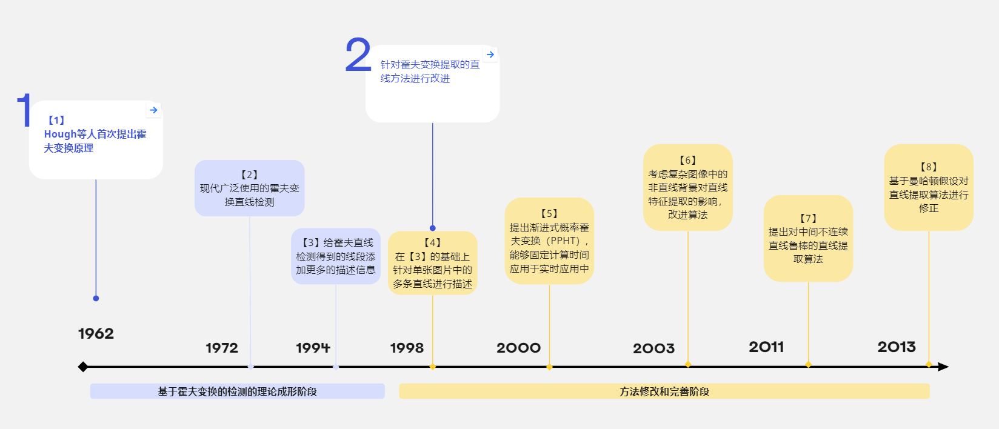
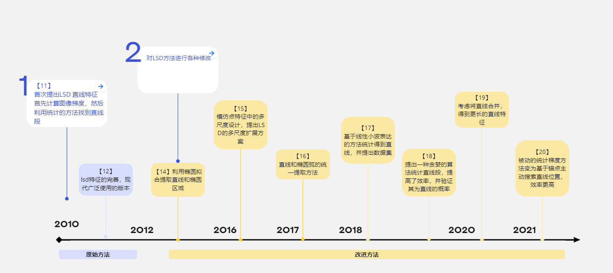
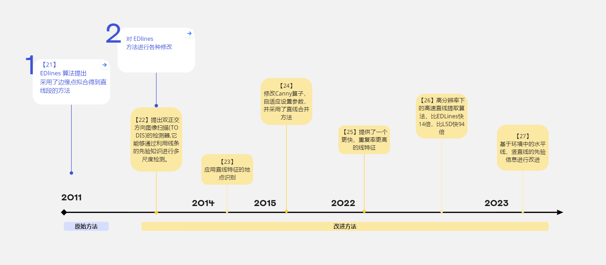

<!-- #! https://zhuanlan.zhihu.com/p/629450344 -->

> 这里是视觉SLAM中的研究点专栏，将会定期分享视觉SLAM算法研究过程中可以深入研究的方向的概述。每一个细分小方向的文献量控制在30篇以内，拒绝大而笼统的概述。致力于为SLAMer提供一个开拓方向的思路。

# 手工直线特征提取概述

直线特征近些年来被添加到各主流SLAM系统中，并被认为能够提升SLAM系统的精度以及在挑战性场景下的鲁棒性。直线特征有如下的优势：

1. 语义信息明确，特征点的语义定义模糊，而直线特征则具有清晰的语义概念
2. 鲁棒性强，直线特征对光照、视角等变化具有更强的鲁棒性
3. 精度高，直线特征具有明确的像素位置，而更高级的语义信息如车辆、行人等的像素位置模糊，难以精确定位

可以说，直线特征在保留了传统特征的精度的同时，具有更强的鲁棒性和语义信息。但是也有着其自身的缺点：

1. 提取难度大，直线特征的提取难度大于点特征
2. 多视图几何关系、算法实现更为复杂

本文对手工直线特征进行了总结，核心代表方法有：

1. 霍夫变换 
2. LSD方法，统计梯度信息得到直线
3. EDLines方法，拟合边缘点得到直线

## 基于全局霍夫变换提取直线特征

## 基于局部梯度统计提取直线特征

## 基于局部边缘拟合提取直线特征

## 开源方案汇总

|方法|分类|开源链接|
|---- | ---- | ---- |
|Hough变换 [1] |基于全局霍夫变换|https://opencv.org/|
|HoughP [5]|基于全局霍夫变换|https://opencv.org/|
|AG3line [20]|基于局部梯度|https://github.com/weidong-whu/AG3line|
|FSG [18] | 基于局部梯度|https://github.com/iago-suarez/FSG|
|Linelet [17] |基于局部梯度|https://github.com/NamgyuCho/Linelet-code-and-YorkUrban-LineSegment-DB|
|ELSDc [16] |基于局部梯度|https://github.com/viorik/ELSDc|
|MLSD [15] |基于局部梯度|https://github.com/ySalaun/MLSD|
|LSD [12] |基于局部梯度|http://www.ipol.im/pub/art/2012/gjmr-lsd/?utm_source=doi|
|LSWMS [13] |基于局部梯度|https://sourceforge.net/projects/lswms/|
|GEDRLSD [27] | 基于局部边缘拟合 |https://github.com/roylin1229/GEDRLSD|
|ELSED [25] | 基于局部边缘拟合 |https://iago-suarez.com/ELSED|
|FLD [23] | 基于局部边缘拟合 |https://opencv.org/|
|CannyLines [24] | 基于局部边缘拟合 |https://cvrs.whu.edu.cn/cannylines/|
|EDLines [21] | 基于局部边缘拟合 |https://github.com/CihanTopal/ED_Lib|

## 参考文献

[1] P. V. Hough, “Method and means for recognizing complex patterns,” Dec. 1962, uS Patent 3,069,654.
[2] R. O. Duda and P. E. Hart, “Use of the hough transformation to detect lines and curves in pictures,” Commun. ACM, vol. 15, no. 1, p. 11–15, 1972.
[3] M. Atiquzzaman and M. W Akhtar, “Complete line segment description using the hough transform,” Image Vis. Comput., vol. 12, no. 5, pp. 267–273, 1994.
[4] V. Kamat-Sadekar and S. Ganesan, “Complete description of multiple line segments using the hough transform,” Image Vis. Comput., vol. 16, no. 9, pp. 597–613, 1998.
[5] J. Matas, C. Galambos, and J. Kittler, “Robust detection of lines using the progressive probabilistic hough transform,” Comput. Vis. Image Underst., vol. 78, no. 1, pp. 119–137, 2000.
[6] Y. Furukawa and Y. Shinagawa, “Accurate and robust line segment extraction by analyzing distribution around peaks in hough space,” Comput. Vis. Image Underst., vol. 92, no. 1, p. 1–25, 2003.
[7] S. Du, C. Tu, B. J. van Wyk, and Z. Chen, “Collinear segment detection using ht neighborhoods,” IEEE Trans. Image Process., vol. 20, no. 12, pp. 3612–3620, 2011.
[8] R. Tal and J. H. Elder, “An accurate method for line detection and manhattan frame estimation,” in Asian Conference on Computer Vision, Daejeon, Korea, Nov. 2012, pp. 580–593.
[9] Z. Xu, B.-S. Shin, and R. Klette, “A statistical method for line segment detection,” Comput. Vis. Image Underst., vol. 138, no. C, p. 61–73, 2015.
[10] Z. Xu, B.-S. Shin, and R. Klette, “Accurate and robust line segment extraction using minimum entropy with hough transform,” IEEE Trans. Image Process., vol. 24, no. 3, pp. 813–822, 2015.
[11] R. Grompone von Gioi, J. Jakubowicz, J.-M. Morel, and G. Randall, “Lsd: A fast line segment detector with a false detection control,” IEEE Trans. Pattern Anal. Mach. Intell., vol. 32, no. 4, pp. 722–732, 2010.
[12] R. Grompone von Gioi, J. Jakubowicz, J.-M. Morel, and G. Randall, “Lsd: a line segment detector,” Image Process. Line, vol. 2, pp. 35–55, 2012
[13] M. Nieto, C. Cuevas, L. Salgado, and N. Garc´ıa, “Line segment detection using weighted mean shift procedures on a 2d slice sampling strategy,” Pattern Anal. Appl., vol. 14, no. 2, pp. 149–163, 2011.
[14] V. Pa˘zTr ´ a˘zUcean, P. Gurdjos, and R. G. Gioi, “A parameterless line segment and elliptical arc detector with enhanced ellipse fitting,” in Eur. Conf. Comput. Vis., Florence, Italy, Oct. 2012, p.572–585.
[15] Y. Salaun, R. Marlet, and P. Monasse, “Multiscale line segment detector for robust and accurate sfm,” in Int. Conf. Pattern Recog., Cancun, Mexico, Dec. 2016, pp. 2000–2005.
[16] V. Patr ˘ aucean, P. Gurdjos, and R. Grompone von Gioi, “Joint a contrario ellipse and line detection,” IEEE Trans. Pattern Anal. Mach. Intell., vol. 39, no. 4, pp. 788–802, 2017.
[17] N.-G. Cho, A. Yuille, and S.-W. Lee, “A novel linelet-based representation for line segment detection,” IEEE Trans. Pattern Anal. Mach. Intell., vol. 40, no. 5, pp. 1195–1208, 2018.
[18] I. Suarez, E. Mu ´ noz, J. M. Buenaposada, and L. Baumela, “Fsg: A statistical approach to line detection via fast segments grouping,” in IEEE Int. Conf. Intell. Robots Syst., Madrid, Spain, Oct. 2018, pp.97–102.
[19] Q. Yu, G. Xu, Y. Cheng, and Z. H. Zhu, “Plsd: A perceptually accurate line segment detection approach,” IEEE Access, vol. 8, pp. 42 595–42 607, 2020.
[20] Y. Zhang, D. Wei, and Y. Li, “Ag3line: Active grouping and geometry-gradient combined validation for fast line segment extraction,” Pattern Recognit., vol. 113, p. 107834, 2021.
[21] C. Akinlar and C. Topal, “Edlines: A real-time line segment detector with a false detection control,” Pattern Recognit. Lett., vol. 32, no. 13, pp. 1633–1642, 2011.
[22] K. Yang, S. Sam Ge, and H. He, “Robust line detection using two-orthogonal direction image scanning,” Comput. Vis. Image
Underst., vol. 115, no. 8, pp. 1207–1222, 2011.
[23] J. H. Lee, S. Lee, G. Zhang, J. Lim, W. K. Chung, and I. H. Suh, “Outdoor place recognition in urban environments using straight lines,” in IEEE Int. Conf. Robot. Autom., Hong Kong, China, Jun. 2014, pp. 5550–5557.
[24] X. Lu, J. Yao, K. Li, and L. Li, “Cannylines: A parameter-free line segment detector,” in IEEE Int. Conf. Image Process., Quebec City, QC, Canada, Sep. 2015, pp. 507–511.
[25] I. Suarez, J. M. Buenaposada, and L. Baumela, “Elsed: Enhanced line segment drawing,” Pattern Recognit., vol. 127, p. 108619, 2022.
[26] I. C. Yilmaz and I. C. Baykal, “Ultrafast line detector,” J. Electron. Imaging, vol. 31, no. 4, p. 043019, 2022.
[27] X. Lin, Y. Zhou, Y. Liu, and C. Zhu, “Level-line guided edge drawing for robust line segment detection,” in IEEE Int. Conf.    Acoust. Speech Signal Process., Rhodes Island, Greece, Jun. 2023.